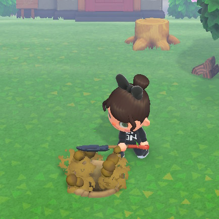

**BANE ART** 

**Category:** Misc
**Concepts:** DNS recon, dig

**Problem Statement:**
sylv3on_ was visiting cybercastors island and thought it'd be funny to bury the flag.txt. Can you help us DIG it out?

**Hints**
None

After hours and hours of making attempts at steganography and running binwalk a million times, the admin revealed on discord that this problem has got nothing to do with stego.

So the all caps DIG caught my attention. I googled and found out it's a DNS recon tool. I used it to find all TXT records(since they mentioned flag.txt) of the CTF website, but no luck.

After some brainstorming, I thought why not dig the official website of cybercastors, and yep there the flag was in a TXT record of the official domain of cybercastors

Command: `dig txt cybercastors.com`

**FLAG:** castorsCTF{L00K_1_DuG_uP_4_fL4g_464C4147}

