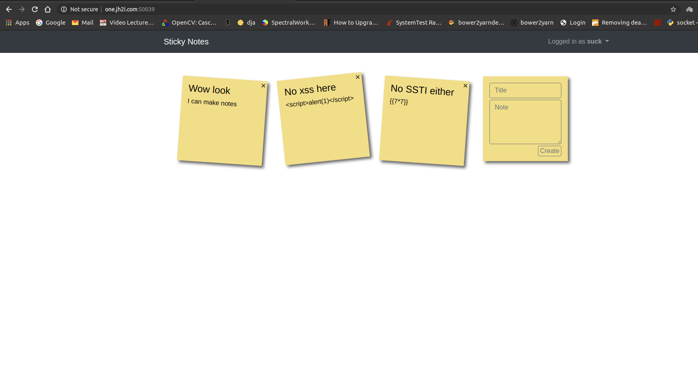
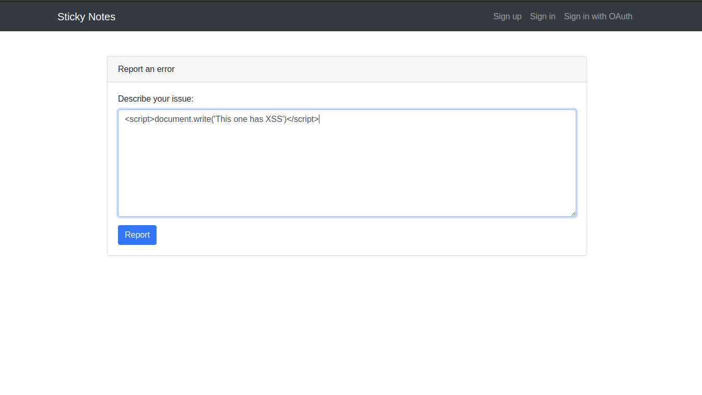
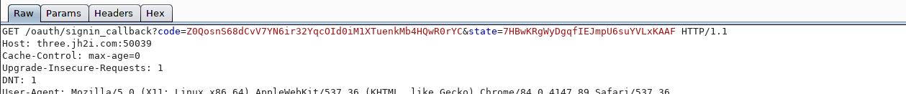
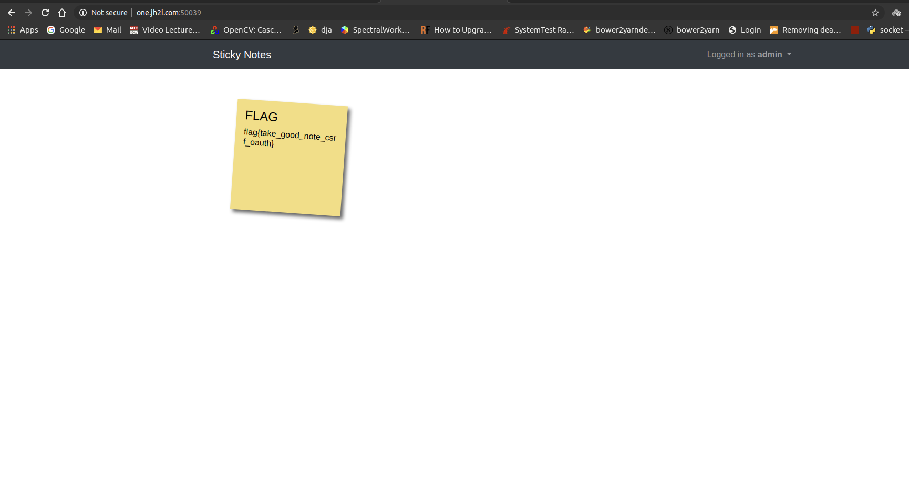

**NOTES SURFER** 

**Category:** Web
**Concepts:** oauth, csrf

**Problem Statement:**
Check out our new sticky note website!
(link to main webpage)
(link to oauth provider)

**Hints**
None

Once I made accounts on the provider and main pages, There was an option to link the oauth provider to the main account.
On inspection of the landing page, I immediately tried XSS and SSTI on the notes. Both Absent

On further inspection I found another end point /report

I tried to use XSS here but since the XSS was blind, I fired my VPS and used the payload

``

and soon got a request on my access logs.

GREAT, so we have something now.

I tried to get the cookies by `` but it seems all the cookies on the admin were HTTPOnly, so no luck there.

**Failed Attempt**

Next I realized that I could probably steal the admin's oath code if I somehow make the callback redirect to a page where the note with my XSS is stored.
So, I did the following

#Step 1: Create an XSS to get the url

Payload:

``

and sent it off

__Note that this xss not only gives us the URI of where the reported notes are stored but is also used to get the oauth code(since it is also sent via a GET request)__

#Step 2: Change the redirect URI in the Oauth request to this URI we recieved(this is the page accessible by admin where the reported note is stored)

Since this URI contains an XSS to send the current URL to my VPS, it should send the code to my VPS.

The oauth request looks like this `http://one.jh2i.com:50020/oauth/authorize?response_type=code&client_id=QJ7Bo88ZBioNTZSXTOJrMYDx&redirect_uri=http%3A%2F%2Fthree.jh2i.com%3A50039%2Foauth%2Fsignin_callback&scope=profile&state=7HBwKRgWyDgqfIEJmpU6suYVLxKAAF&action=signin`

The state is not checked so you can also omit it.

#Step 3: Login as admin using the oauth code

But the whitelisting on the redirect URI was strong and I couldn't change it, so this method failed.

**Successful Attempt**

I also noticed that the oauth code was one-time only. So I fired up burpsuite to intercept this code and drop the request. This was so that my code can be used by someone else (this someone is going to be the admin)

#Step 1: Initiate linking of oauth provider account with your main account

#Step 2: Drop the request which sends the oauth code from provider to main:

Use proxy like BurpSuite for this, make sure to copy the oauth code

#Step 3: Use the XSS to perform a CSRF and spoof admin's account to link with your oauth:

Now that you have this oauth code, anyone who makes GET request to the url with the code, will have their main account linked to YOUR oauth provider account.
So use the XSS to do this to the admin

Payload:
``

#Step 4: Login with your oauth:

Now that your oauth is linked to the admin's main account, signing in through oauth will sign you into admin's main account.

**FLAG:** flag{take_good_note_csrf_oauth}

